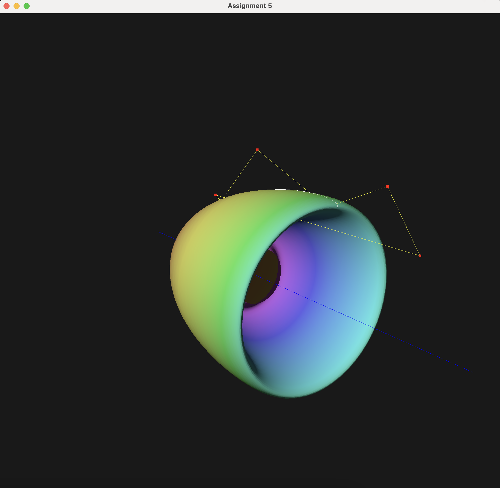

# Computer Project 5 — Bezier Curves & Revolution Surfaces
**CSCI 557 / Computer Graphics**

<p align="center">
  
</p>

## Build

### Linux / macOS

```bash
bash compile-unx.bat
```

### Windows

```bat
compile-win.bat
```

### Requirements

- Vulkan SDK
- GLFW
- GLM

---

## Program Usage

The program starts in **Edit Mode** with:

- **Orthographic view**
- **Y-up**
- Looking along **+Z**

The horizontal **blue line** is the **axis of revolution** (**X-axis**).

Draw control points in the **upper half of the window** to define the profile curve.

---

## Key Bindings

### Edit / General

| Key | Action |
|---|---|
| `SPACE` | Toggle between **Edit Mode** and **Navigation Mode** |
| `ESC` | Quit |

### Edit Mode

| Input | Action |
|---|---|
| `Left-click` | Add a control point above the axis (`Y > 0`) |

After at least **2 points**, the Bezier profile curve updates automatically.

### Surface Generation

| Key | Action |
|---|---|
| `B` | Build the revolution surface from the current Bezier profile |
| `N` | Show / hide normal vectors on the surface |
| `M` | Reset everything: clear control points, curve, and surface |

### Camera Navigation

Navigation Mode must be enabled with `SPACE`.

| Input | Action |
|---|---|
| `Arrow keys` | Rotate (`left/right` = azimuth, `up/down` = elevation) |
| `Shift + Arrows` | Pan the look-at target |
| `=` or `KP_+` | Zoom in |
| `-` or `KP_-` | Zoom out |
| `Numpad 4 / 6 / 8 / 2` | Same as arrow keys |
| `F` | Fit all / auto-frame the entire surface |
| `C` | Toggle **Perspective** ↔ **Orthographic** projection |

### Mouse Controls (optional)

| Input | Action |
|---|---|
| `R` + drag | Rotate |
| `P` + drag | Pan |
| `Z` + drag | Zoom |
| `T` + drag | Twist / roll |

### Phase 5 — Creativity Features

| Key | Action |
|---|---|
| `X` | Toggle **Twist** mode |
| `G` | Toggle **Color Gradient** mode |

> After toggling `X` or `G`, press `B` again to rebuild the surface.

---

## Example Workflow

1. Launch the program — it starts in **Edit Mode**.
2. Click several points above the blue axis to draw a profile curve.
3. Press `B` to generate the surface of revolution.
4. Press `N` to display green normal arrows.
5. Press `SPACE` to switch to **Navigation Mode**.
6. Use `R` + drag to rotate, `P` + drag to pan, and `Z` + drag to zoom.
7. Press `F` to fit the surface in view.
8. Press `SPACE` again to return to **Edit Mode**.
9. Press `M` to reset and start over.
10. Press `X`, then `B` to rebuild with the helical twist effect.
11. Press `G`, then `B` to rebuild with rainbow axial coloring.

---

## Phase Descriptions

### Phase 1 — Bezier Curve

- Left-click adds control points.
- Screen coordinates are mapped to **NDC** `[-1, 1]`.
- `_allBernstein` computes all Bernstein basis values at `u`.
- The curve is re-evaluated at resolution **200** after every new point.

### Phase 2 — Revolution Surface

- The 2D profile uses:
  - **X-axis** = axial direction
  - **Y-axis** = radius
- The profile is revolved **360°** around the X-axis.
- Default surface resolution: **50 × 50**
- Each vertex position is:

```text
(px, pr·cosθ, pr·sinθ)
```

- Indices form **two CCW triangles per quad**.

### Phase 3 — Normal Vectors

- The 2D tangent is computed using the **Bezier derivative**.
- The 2D outward normal is the perpendicular:

```text
(−ty, tx)
```

- The 3D normal is:

```text
(−ty, tx·cosθ, tx·sinθ)
```

- These normals are analytically unit-length.
- Press `N` to show **green arrows** with length equal to **5%** of the surface scale.

### Phase 4 — User Interaction

- `SPACE` toggles **Edit Mode** ↔ **Navigation Mode**
- **Edit Mode** uses orthographic projection for precise point placement
- **Navigation Mode** supports orbit, pan, and zoom through keyboard/mouse interaction
- `M` resets both CPU-side data and GPU buffers after waiting for device idle

### Phase 5 — Creativity Features

#### Twist (`X`, then `B`)

```text
theta_actual = j·Δθ + u·2π
```

Each axial ring is rotated by an additional angle proportional to its `u` parameter, producing a **360° helical spiral** along the surface.

This extends the standard surface-of-revolution formula by modifying the angular term and creates a visually distinct twisted surface.

#### Color Gradient (`G`, then `B`)

Each ring of vertices is assigned a color by mapping:

- `u ∈ [0,1]`
- to hue `∈ [0°, 300°]` in HSV space
- with `s = 0.85`, `v = 0.95`

This is then converted to RGB.

The gradient helps:

- visualize axial parameterization,
- distinguish rings during debugging,
- and improve appearance.

---

## Files Modified / Added

| File | Description |
|---|---|
| `my_bezier_curve_surface.h` | Added twist/color fields and accessors |
| `my_bezier_curve_surface.cpp` | Implemented Phases 1, 2, 3, and 5 |
| `my_application.h` | Added `toggleTwist`, `toggleColorGradient` |
| `my_application.cpp` | Implemented Phase 4, camera bounding box update, and Phase 5 wiring |
| `my_window.cpp` | Added `X` and `G` key bindings |
| `README.txt` | Original project description |

---

## Author Notes

- Normal vectors are computed **analytically**, which avoids finite-difference approximation errors.
- This produces smoother shading and reduces artifacts near high-curvature regions.
- UV coordinates are already stored in each vertex:
  - `u` = axial coordinate
  - `v` = angular coordinate / `2π`

These UVs are ready for future **texture mapping** if a sampler descriptor is added to the rendering pipeline.
